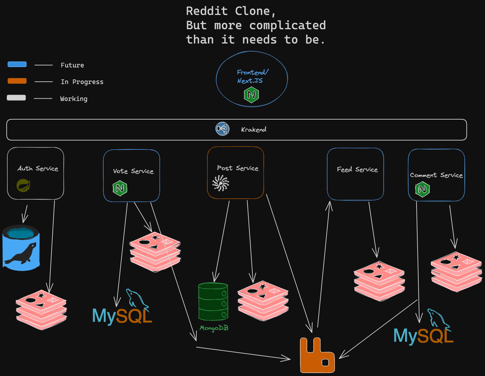

# Threadit
## A Reddit-clone created using a microservice architecture.
 
 My goals for this project are to:

- Get more familiar with microservice architectures
- Create a highly scalable and performant application
- Implement authentication and authorization using JWTs
- Learn how to use a message broker
- Try out using a NoSQL database
- Implement caching where it makes sense
- Implement a load balancer
- Use only devcontainers for development (no local installations)
- Create a Docker compose file for easy deployment of the entire application

I am trying to use as many different languages and technologies as possible to get a feel for what's out there and what I enjoy working with. I am also trying to use *(what I think is)* the best tool for the job, so I am not using a single language or technology for all services.

--------------------

## Architecture diagram

## CI/CD diagram

